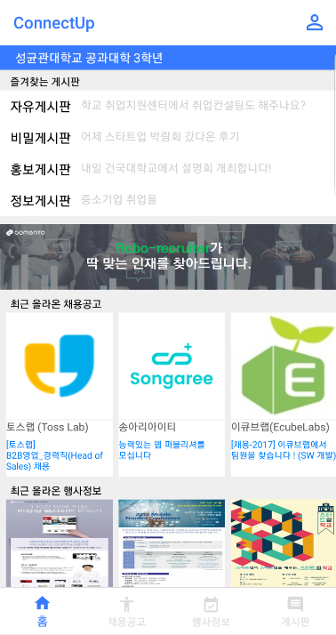
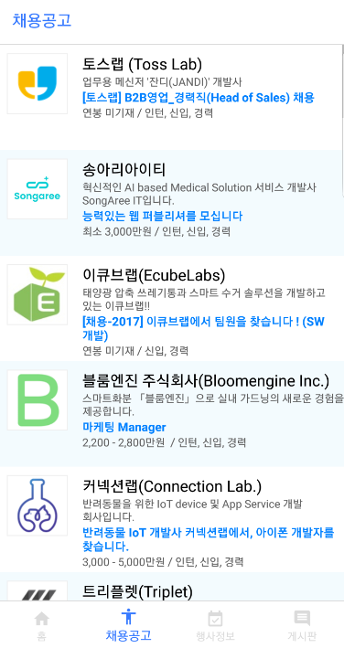
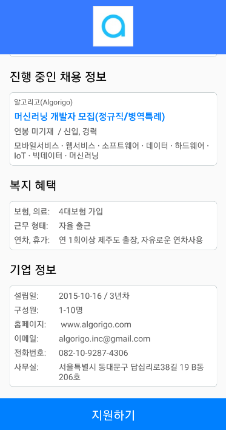

# ConnectUp

    

커넥트업은 채용을 원하는 대학생들과 구인 중인 스타트업을 연계해주는 플랫폼입니다. 학생 개개인의 프로필 및 이력 정보를 이력서와 유사한 형태로 저장 및 제공하여 스타트업에게 맞춤형 인재를 추천합니다. 또한 학생은 본인이 희망하고 본인의 경험에 적합한 스타트업 정보를 열람할 수 있으며 지원할 수 있습니다.

*한국대학생IT경영학회 17기 학술제 출품작으로, 프론트엔드 부분 구현 앱입니다.*